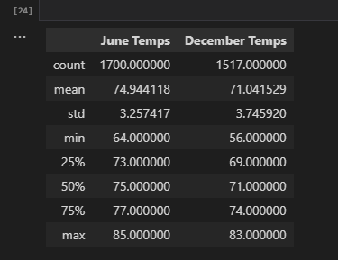

# Surfs Up

## Project Overview
In this challenge we are taking 

## Overview of the statistical analysis
The purpose of this analysis is to find the data for June temperatures and December temperatures. In order to do so I need to incorporate sqlalchemy in order to import the data into two data frames. One for each month.

## Results
1. Temperature is consistently surfable in June. 
As the mean is 74.94 degrees compared to December's 71.04 degrees.

2. If we look at the min we can see that June is at 64 degrees compared to December where it is at 56 degrees.This means that there is a chance it will be 10 degrees colder which is not ideal surf weather.

3. If you want to guarantee more surfable days book a vacation in June over December.

## Summary

Using the two functions below we can compare the summary stats side by side. One on a general level and the second on a daily level. We can compare the overall days that are surfable at the same time.

General
june_data = june_df.describe()
dec_data_compare = dec_results_df.describe()
compare = june_data.merge(dec_data_compare,left_index= True, right_index= True)
compare

Daily
june_data2 = june_df
dec_data_compare2 = dec_results_df
compare2 = june_data2.merge(dec_data_compare2,left_index= True, right_index= True)
compare2

